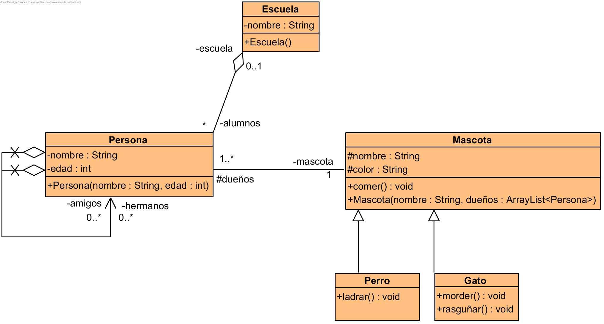

# Caso 1

Sofía, tiene 6 años de edad y tiene un perro que ladra y come. Ella va a la escuela junto con otros 5 o más niños. Uno de esos niños es hermano de Sofía y se 
llama Pablo, quién tiene 10 años de edad. Ambos son dueños del mismo perro de color café llamado _firulais_. Pablo tiene al menos un amigo que se llama Pedro
(también tiene 10 años) y él es dueño de un gato de muy mal carácter que muerde y rasguña llamado _misifus_.

## Clases Presentes

* Persona
* Mascota
* Perro
* Gato
* Escuela

