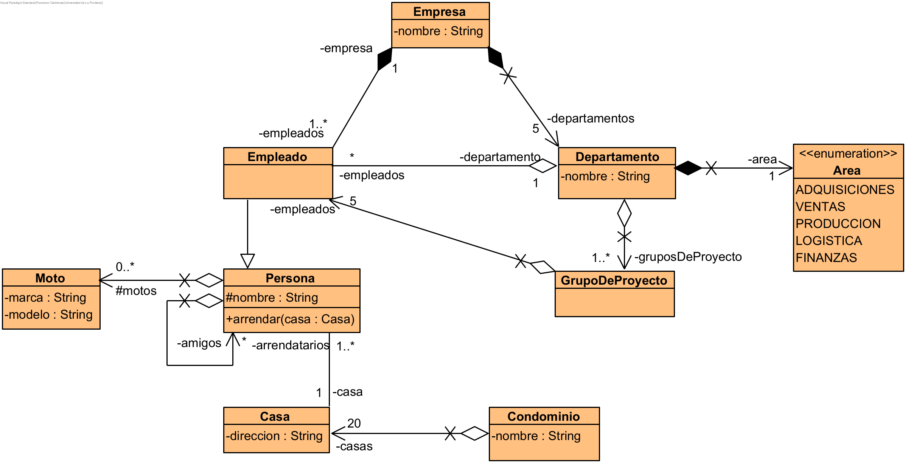

# Caso 02

Agustín tiene una moto Harley Davidson 1200 Custom.

Agustín es empleado del departamento de adquisiciones de la empresa naviera Tesoros del Mar S.A.

Dicha empresa naviera se encuentra compuesta por un conjunto de 5 departamentos (adquisiciones, ventas, producción, logística y finanzas). En cada
departamento hay al menos un grupo de proyecto y cada grupo está relacionado con 5 empleados.

Uno de los colegas de Agustín es Francisco y trabaja en el departamento de ventas. Ambos colegas arriendan en conjunto una casa, que junto a otras 19 casas
forman parte del condominio Nuevo Amanecer.

Francisco tiene una amiga llamada Andrea, quien tiene una moto Kawasaki Ninja Zx 6R 636.

## Clases presentes

* Persona
* Moto
* Empleado
* Empresa
* Departamento
* GrupoProyecto
* Condominio
* Casa

